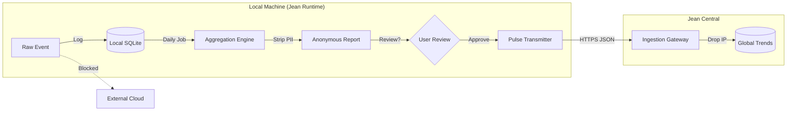

# Jean Data Intelligence Layer
**Architecture of a "No-Spying" Analytics Engine**

## 1. Core Philosophy: The Privacy Firewall
Traditional analytics send raw events to the cloud. Jean processes events **locally**, aggregates them into **anonymous histograms**, and only transmits the "shape" of usage, never the user's specific actions.

**The Golden Rule:**
> "We can know that *a* user clicked 'Cancel' 50 times, but we can never know *which* user did it."

---

## 2. Architecture Diagram



---

## 3. Data Processing Pipeline

### Stage 1: Local Collection (Raw)
*   **What:** Full fidelity logs for the *user's* benefit (Audit Log).
*   **Storage:** `jean_audit_logs` (Encrypted, Local).
*   **Retention:** Defined by user tier (7 days / 1 year).
*   **Example:** `User X clicked 'Block' on Agent Y at 10:00 AM.`

### Stage 2: Local Aggregation (The "Intelligence")
*   **Trigger:** Once every 24 hours.
*   **Process:** Scans raw logs and updates counters.
*   **Output:** `jean_daily_metrics` (No User ID, No timestamps, Date only).
*   **Example:** `{"date": "2025-01-01", "metric": "agent_block_count", "value": 1}`

### Stage 3: The Pulse (Transmission)
*   **Requirement:** Explicit Opt-In (during onboarding).
*   **Payload:**
    ```json
    {
      "schema_version": "1.0",
      "cohort": "pro_users_v1",  // Broad grouping only
      "metrics": {
        "agents_blocked_total": 45,
        "fs_read_refusals": 12,
        "avg_session_duration_minutes": 15
      }
    }
    ```
*   **Network:** Requests are sent via a proxy that strips IP addresses before they reach the analytics DB.

---

## 4. Use Cases & Intelligence

### A. UX Improvement (The "Friction Heatmap")
*   **Problem:** Are users confused by the "Capability Request" dialog?
*   **Signal:** High ratio of `capability_dialog_dismissed` vs `capability_dialog_accepted`.
*   **Action:** If global ratio > 20%, redesign the dialog to be clearer.
*   **Privacy:** We don't know *who* dismissed it, just that it's happening a lot.

### B. Feature Prioritization (Voting with Feet)
*   **Problem:** Should we improve the Docker integration or the Vector Store?
*   **Signal:** Compare `tab_active_docker` vs `tab_active_memory`.
*   **Action:** Allocate engineering resources to the most used tab.
*   **Privacy:** No specific usage patterns are revealed.

### C. Governance Tuning (Crowdsourced Safety)
*   **Problem:** Is "Agent Smith" malicious?
*   **Signal:** Sudden spike in `agent_stop_command_issued` across the entire user base.
*   **Action:** The central registry automatically flags "Agent Smith" as "Suspicious".
*   **Privacy:** The "Stop" signal is anonymous, but the *target* (the agent) is public.

---

## 5. Legal Justification & Compliance

### A. GDPR (Europe)
*   **Basis:** **Anonymization**.
*   **Recital 26:** "The principles of data protection should not apply to anonymous information... which does not relate to an identified or identifiable natural person."
*   **Mechanism:** By aggregating locally and stripping IPs at the gateway, the data landing in our DB is not "Personal Data."

### B. CCPA / CPRA (California)
*   **Category:** **Aggregate Consumer Information**.
*   **Exemption:** CPRA explicitly exempts data that is "not linked or reasonably linkable to any consumer or household."
*   **Constraint:** We must not (and cannot) "re-identify" the data.

### C. The "No-Sell" Guarantee
*   **Policy:** We monetize **Software** (Subscriptions) and **Services** (Enterprise Support). We do not have a business model that requires selling data.
*   **Technical Proof:** The data structure itself (counters) is useless to advertisers. They want profiles; we only have histograms.

---

## 6. Implementation Notes

*   **K-Anonymity:** If a metric count is < 5 (e.g., "Agents named 'Bob'"), it is dropped from the report to prevent fingerprinting unique behaviors.
*   **Randomized Response (Optional):** For sensitive questions (e.g., "Did you jailbreak?"), we can add mathematical noise (Differential Privacy) so the server never knows the truth for any single user, only the aggregate percentage.
