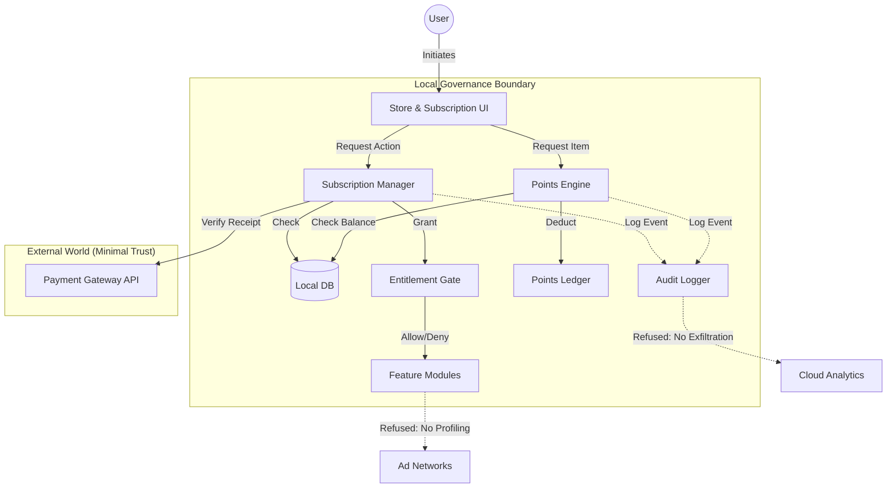

# Jean Monetization Infrastructure Design

## 1. Architectural Principles
This infrastructure enforces a **Sovereign Subscription Model**.
- **Local Authority:** The user's local database is the source of truth for entitlements. Syncing with a payment provider is a secondary check, not the primary gate.
- **Explicit Consent:** No charge, upgrade, or point deduction happens without a user-initiated event.
- **Privacy Wall:** The payment processor (Stripe/LemonSqueezy) knows *who* paid. The local Jean instance knows *what* they are doing. These two data streams are never merged for profiling.

## 2. Component Diagram



## 3. Data Flow & Logic

### A. Subscription Tiers & Entitlements
Tiers are defined in `jean_subscription_tiers`. Entitlements are JSON blobs defining limits.

| Tier | Price | Entitlements (Example) |
|---|---|---|
| **Core (Free)** | $0 | Memory: 50MB, Containers: 2, Audit: 7 Days |
| **Pro** | $20/mo | Memory: 5GB, Containers: Unlimited, Audit: Forever |
| **Enterprise** | Custom | Memory: Unlimited, Policy Push, Team Governance |

### B. The Entitlement Check
When a user tries to use a feature (e.g., "Add 3rd Docker Container"):
1.  **Feature** asks **Entitlement Gate**: `CanUser('docker_containers_count')`?
2.  **Entitlement Gate** queries `jean_user_subscriptions` (Active Tier).
3.  **Gate** retrieves `tier_config` for that Tier.
4.  **Gate** compares `current_count` vs `limit`.
5.  **Result:** Allow or Deny.
6.  **Audit:** If Denied, log "Entitlement Refusal: Upgrade Required".

### C. Points Integration
Points are a parallel currency for one-off unlocks, distinct from recurring subscriptions.
- **Scenario:** User on "Core" tier wants "Dark Mode" (Pro feature).
- **Action:** User spends 1000 points.
- **Logic:** `jean_user_redemptions` adds an override record.
- **Gate:** Checks `jean_user_subscriptions` OR `jean_user_redemptions` for the feature flag.

## 4. Refusal Cases (Governance Enforced)

| Scenario | System Response | Reason |
|---|---|---|
| **Auto-Upgrade:** User hits memory limit. System tries to charge card for Pro. | **REFUSED** | Financial actions must be user-initiated. |
| **Silent Renewal:** Subscription renews without notification. | **FLAGGED** | UI must show "Renewal Pending" alert 7 days prior. |
| **Data Barter:** "Share your browsing history for 500 points." | **REFUSED** | Data monetization is strictly forbidden. |
| **Dark Pattern:** "Cancel Subscription" button is hidden/greyed out. | **BANNED** | Cancellation must be 1-click in the main settings. |
| **Profiling:** "You buy a lot of crypto, buy the Finance Pack." | **REFUSED** | No behavioral profiling allowed. |

## 5. Audit & Metrics (Aggregate Only)

### Local Audit Log
Every financial/entitlement event is logged locally in `jean_audit_log` (or `jean_actions_log`):
```json
{
  "event": "SUBSCRIPTION_CHANGED",
  "from": "CORE",
  "to": "PRO",
  "initiator": "USER_CLICK",
  "timestamp": 1712345678
}
```

### Telemetry (If Opt-In)
We only send **Aggregated Counters** to the mothership, never user IDs or details.
- Allowed: `total_pro_users: 10500`
- Allowed: `feature_usage_docker: 5000`
- Forbidden: `User_123 used docker at 2AM`

## 6. Implementation Plan (Phase 1)
1.  **Database:** Create tables for Tiers, Subscriptions, and Entitlements.
2.  **Middleware:** Build the `EntitlementGate` logic in Rust/Tauri backend.
3.  **UI:** Build the "Plans" page in React (Settings section).
