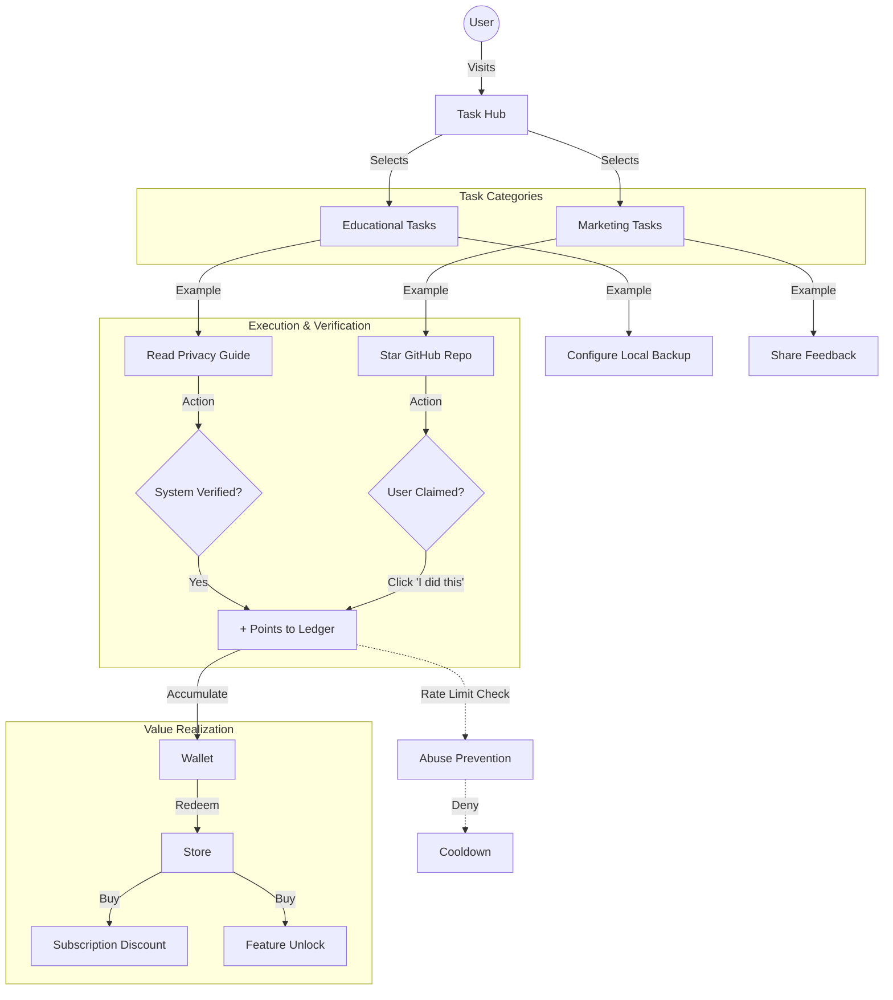

# Jean Task → Points → Value System
**Design Principles:** No Addiction. No Time Pressure. Transparent Scoring.

## 1. System Overview
This system incentivizes **competence** and **contribution**, not engagement. Users earn points by becoming better users (Educational) or helping the platform grow (Marketing), but only via explicit, low-pressure actions.

## 2. Flow Diagram

## 3. Task Categories & Rules

### A. Educational Tasks (Competence)
*Goal: Ensure the user knows how to use the system safely.*
*   **Scoring:** High Value (100-500 pts).
*   **Verification:** Deterministic (System checks if settings changed).
*   **Examples:**
    1.  **"The Sovereign Setup" (500 pts):** Complete the tutorial on local storage and encryption keys.
    2.  **"Audit Auditor" (200 pts):** Open the Audit Log for the first time and filter by "Network".
    3.  **"Permission Cleaner" (100 pts):** Revoke an unused permission grant.

### B. Marketing Tasks (Contribution)
*Goal: Grow the ecosystem without tracking pixels.*
*   **Scoring:** Low/Medium Value (50-100 pts).
*   **Verification:** Trust-based or API-based (Read-Only).
*   **Examples:**
    1.  **"Star on GitHub" (50 pts):** User clicks link. We ask: "Did you star it?" User clicks "Yes". We trust them (or check public API if token provided).
    2.  **"Social Share" (100 pts):** "Tell a friend about Jean." No tracking link used. Trust-based claim.

## 4. Abuse Prevention (The "Anti-Farm" Layer)

Since we rely partly on trust (client-side verification), we need safeguards against script-kiddies.

### Rule 1: The Daily Cap
*   **Limit:** Max **1,000 points** earned per 24 hours.
*   **Reason:** Makes script-farming inefficient. It would take 50 days to earn a major discount, discouraging automated attacks.

### Rule 2: The Wallet Cap
*   **Limit:** Max **50,000 points** balance.
*   **Reason:** Prevents hoarding liabilities.

### Rule 3: Frequency Limiting
*   **Task Type:** "Social Share" can only be claimed **once per 30 days**.
*   **Task Type:** "Read Tutorial" is **one-time only**.

### Rule 4: Server-Side Redemption Check
*   When redeeming a "10% Discount" (real money impact), the server performs a sanity check:
    *   *Input:* `User_ID`, `Points_Claimed`, `Account_Age`.
    *   *Logic:* Is `Points_Claimed` mathematically possible given `Account_Age`?
    *   *Action:* If `Points > (Account_Age_Days * 1000)`, **Flag for Review**.

## 5. Value Realization (Redemption)

### Value Tier 1: System Utility (Low Cost)
*   **Cost:** 100 - 500 pts.
*   **Items:** Dark Mode, Custom Icons, Beta Access.
*   **Logic:** Pure database flag. No financial cost to us.

### Value Tier 2: Financial Benefit (High Cost)
*   **Cost:** 1,000 - 5,000 pts.
*   **Items:** 1 Month Pro Free, 10% Lifetime Discount.
*   **Logic:** Generates a unique Stripe Coupon. Rate-limited (e.g., 1 coupon per year).

## 6. Anti-Addiction Measures (Governance)
*   **No Streaks:** We never say "You're on a 5-day streak! Don't break it!".
*   **No Timers:** Tasks do not expire. "Do it now or lose it" is banned.
*   **No Loot Boxes:** Rewards are fixed. 100 pts is always 100 pts. No randomization.
