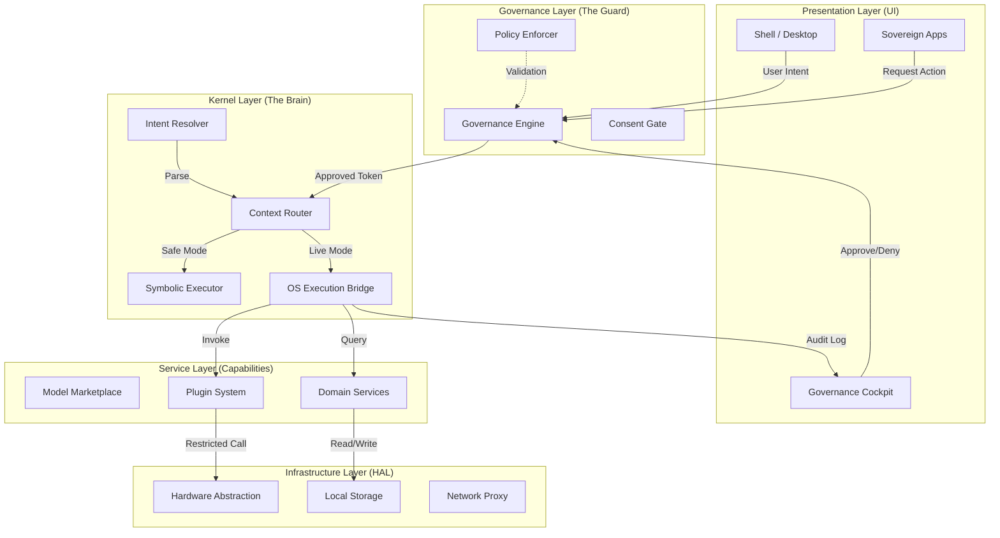

# Jean System Architecture

This document outlines the high-level architecture of the Jean Sovereign Operating System.

## 1. High-Level Layer Diagram

## 2. Component Detail Breakdown

### Layer 1: Presentation (UI)
*   **Shell**: The main container, managing windows and global state.
*   **Governance Cockpit**:
    *   **Zone A (Graph)**: Visualizes the execution DAG.
    *   **Zone B (Inspector)**: Details on selected nodes/data.
    *   **Zone C (Controls)**: Physical-style buttons for HALT/APPROVE.
*   **Sovereign Apps**: React-based views for specific domains (Travel, Commerce).

### Layer 2: Governance
*   **Governance Engine**: A finite state machine (`IDLE` -> `REVIEW` -> `EXECUTING`). It is the single source of truth for "Is this allowed to run?".
*   **Consent Gate**: Manages user permissions, checking signatures and tokens.
*   **Policy Enforcer**: Static analysis of requested pipelines against user-defined rules (e.g., "No Network after 10 PM").

### Layer 3: Kernel
*   **Context Router**: Directs traffic based on safety level.
    *   *Symbolic Route*: Mocks execution for preview/safety.
    *   *Live Route*: Passes to the bridge for real execution.
*   **OS Execution Bridge**: The secure gateway to actual system resources. Verifies `ConfirmationTokens` before acting.
*   **Intent Resolver**: Translates high-level goals ("Book flight") into low-level pipeline graphs.

### Layer 4: Services
*   **Model Marketplace**: Manages AI models with a "Deny-by-Default" install policy.
*   **Plugin System**: Sandboxed environment for third-party extensions.
*   **Domain Services**:
    *   `TravelService`: Read-only flight/hotel aggregation.
    *   `LogisticsEngine`: Multi-leg delivery orchestration.
    *   `CommerceSystem`: Supplier verification and product listing.

### Layer 5: Infrastructure (HAL)
*   **Modular HAL**: Interfaces for Jean-native hardware (Physical Kill Switches, Isolated Storage).
*   **Local Storage**: Encrypted, device-bound data persistence (IndexedDB / File System).
*   **Network Proxy**: Controls all outbound requests, ensuring no telemetry leaks.

## 3. Data Flow Example: "Book a Flight"

1.  **User** clicks "Search Flights" in **UI**.
2.  **Intent Resolver** generates an `ExecutionGraph` (Fetch Data -> Filter -> Display).
3.  **Governance Engine** intercepts execution. State: `REVIEW_PENDING`.
4.  **User** reviews the graph in **Cockpit** and clicks "Approve".
5.  **Governance Engine** issues a signed `ConfirmationToken`.
6.  **Kernel Router** sees the token, switches from `Symbolic` to `Live`.
7.  **OS Bridge** executes the `Fetch` via **Network Proxy**.
8.  **Results** return to UI; **Audit Log** records the transaction.
