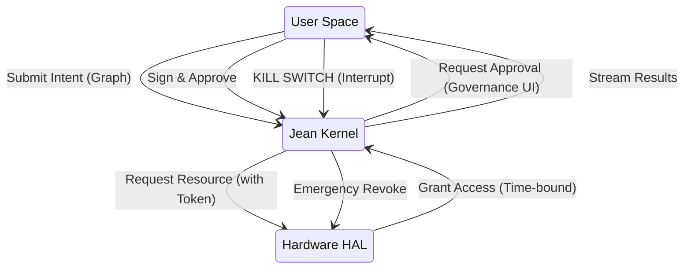

# Jean Kernel Design: The Governance-First Operating System

## 1. Executive Summary

Jean is not just a browser or an agent; it is a **Governance-First Operating System Abstraction**. Unlike traditional kernels (Linux, NT) that prioritize resource efficiency and hardware abstraction, the Jean Kernel prioritizes **intent verification** and **human consent**.

In the Jean architecture:
- **Processes** are visible execution graphs.
- **Permissions** are just-in-time, intent-bound grants.
- **The Shell** is a governance cockpit, not a command line.
- **Applications** are user-auditable pipelines.

## 2. Core Architecture

### 2.1 Process Governance: The "Anti-Scheduler"
Traditional OS schedulers optimize for CPU cycles. The Jean Kernel optimizes for **Human Attention**.

*   **Default State:** `HALT` / `IDLE`.
*   **Execution Logic:** No process runs unless it has a valid `GovernanceToken`.
*   **The Scheduler:** Instead of a round-robin CPU scheduler, Jean uses a **Governance Engine** state machine.
    *   `IDLE` -> `REVIEW_PENDING` -> `APPROVED` -> `EXECUTING` -> `COMPLETED`.
    *   Any violation triggers an immediate `HALT` (Kill-Switch).

### 2.2 Execution Permissions: Intent vs. Capability
*   **Traditional OS (Android/iOS):** "App X has permission to access Camera." (Static, broad).
*   **Jean Kernel:** "Pipeline Y has permission to access Camera *for the next 30 seconds* to *scan a QR code*." (Dynamic, intent-bound).
*   **Mechanism:** `HardwareGovernanceGate` intercepts all HAL calls. It requires:
    1.  **App ID**: Who is asking?
    2.  **Intent**: Why?
    3.  **Duration**: How long?
    4.  **User Signature**: Cryptographic proof of consent.

### 2.3 Pipelines as Applications
In Jean, an "Application" is not a compiled binary black box. It is a **Pipeline**:
*   **Definition:** A Directed Acyclic Graph (DAG) of atomic, inspectable nodes (Inputs -> Transformations -> Outputs).
*   **Visibility:** The source code *is* the execution graph.
*   **Modifiability:** Users can inject "Audit Nodes" or "Filter Nodes" into any third-party pipeline.

### 2.4 UI as Shell
The User Interface is not a wrapper; it is the **Kernel Shell**.
*   **Zone A (Graph):** Visualizes the running process.
*   **Zone B (Inspector):** Shows the data flowing through the "wires".
*   **Zone C (Controls):** The "Physical" buttons for `APPROVE`, `PAUSE`, and `KILL`.

## 3. Comparative Analysis

| Feature | Linux (Traditional) | Android (Mobile) | Windows (Desktop) | Jean Kernel (Sovereign) |
| :--- | :--- | :--- | :--- | :--- |
| **Primary Goal** | Resource Efficiency | User Safety / Sandbox | Backward Compatibility | **User Sovereignty** |
| **Default State** | Run unless blocked | Run in background | Run everything | **Block everything** |
| **Permissions** | `rwx` (User/Group) | Install-time manifests | UAC / Admin Prompts | **Just-In-Time Intents** |
| **Process View** | `top` / `ps` (List) | Settings / Battery | Task Manager | **Visual Execution Graph** |
| **Trust Model** | Trust Root (Root) | Trust Store (Google) | Trust Vendor (MS) | **Trust Nothing (Verify)** |
| **Background** | Daemons allowed | Services allowed | Services allowed | **Banned by default** |

### 3.1 Jean vs. Linux
*   **Linux:** "Root can do anything."
*   **Jean:** "Even Root cannot execute without a specific Intent Token."
*   **Linux:** Ideal for servers where uptime matters.
*   **Jean:** Ideal for personal computing where *privacy* and *control* matter.

### 3.2 Jean vs. Android
*   **Android:** Hides the filesystem and kernel from the user to "protect" them.
*   **Jean:** Exposes the kernel state to the user to *empower* them.
*   **Android:** Permissions are binary (Yes/No forever).
*   **Jean:** Permissions are temporal (Yes for this specific action).

### 3.3 Jean vs. Windows
*   **Windows:** Opaque registry, hidden services, telemetry by default.
*   **Jean:** No registry, no hidden services, zero telemetry.
*   **Windows:** "Update and Restart" (Forced).
*   **Jean:** "Update Available" (User chooses if/when).

## 4. Technical Specification: The Kernel Loop

### 4.1 The "Governance Bus"
Instead of a D-Bus or COM, Jean uses a **Governance Bus**. Every message on this bus must carry a `GovernanceTag`.
*   `tag:user-initiated`: High priority, allowed.
*   `tag:system-maintenance`: Low priority, requires explicit approval.
*   `tag:network-call`: Blocked unless whitelisted.

## 5. Future Roadmap

1.  **Phase 1 (Now):** Logical Kernel implemented in TypeScript (`GovernanceEngine.ts`).
2.  **Phase 2 (Next):** Process Isolation via WebWorkers/WASM.
3.  **Phase 3 (Long-term):** A true microkernel (Rust) replacing the underlying OS layer for dedicated Jean Devices.
