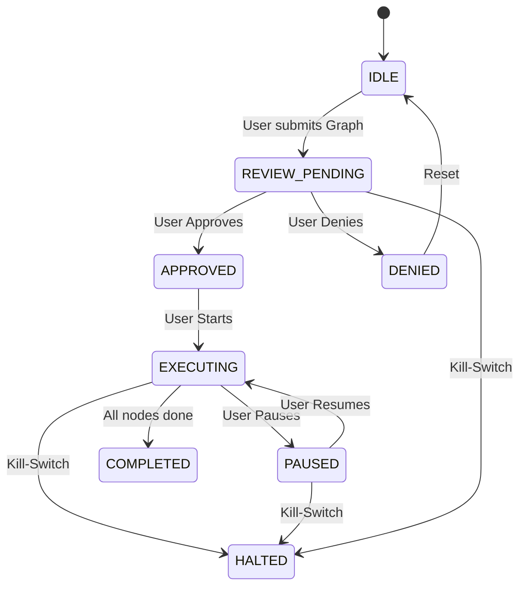

# Governance UI Architecture

## Philosophy
This UI is built on the principle of **"Human-in-the-Loop Governance"**. The AI Kernel is an engine; the human is the pilot. 
- **No Auto-Execution:** The system never transitions from `IDLE` to `EXECUTING` without explicit human approval.
- **Fail-Safe:** The `HALT` (Kill-Switch) is physically distinct and always accessible.
- **Explainable:** Every decision by the routing engine must be traceable before approval is granted.

## UI Layout

The Governance Console uses a "Cockpit" layout divided into three primary zones:

### Zone A: The Execution Graph (Center/Left)
*   **Visual:** Directed Acyclic Graph (DAG) rendering of the `ExecutionGraph`.
*   **State:** 
    *   `Pending` nodes are Grey.
    *   `Approved` nodes are Green.
    *   `Blocked` nodes (awaiting decision) are Amber.
    *   `Active` nodes Pulse.
*   **Interactivity:** Click a node to inspect its `NodeSpec` and `RoutingDecision` in Zone B.

### Zone B: Decision Trace & Inspection (Right Panel)
*   **Context:** Shows details for the selected node or the current pending approval request.
*   **Routing Logic:** Displays *why* a worker was chosen (e.g., "Worker A selected because it has GPU and is Local").
*   **Constraint Checklist:**
    *   [x] Local Only
    *   [x] No Network Access
    *   [x] Model Allowed (DeepSeek-R1)
*   **Audit Log:** Rolling log of state changes and user actions.

### Zone C: Command Deck (Bottom Bar)
*   **Status Indicator:** Large, color-coded status badge (`IDLE`, `REVIEWING`, `EXECUTING`, `PAUSED`, `HALTED`).
*   **Primary Controls:**
    *   **Review Request** (When IDLE)
    *   **Approve / Deny** (When REVIEW_PENDING) -> *Requires "Press and Hold" to prevent accidental clicks.*
    *   **Start Execution** (When APPROVED)
    *   **Pause / Resume** (When EXECUTING/PAUSED)
*   **Emergency Control:**
    *   **HALT (Kill-Switch):** Red, guarded button. Instantly terminates all workers and locks the state.

## State Machine

## Permission Model

| Role | View Graph | Request Review | Approve/Deny | Pause/Resume | HALT |
| :--- | :---: | :---: | :---: | :---: | :---: |
| **Viewer** | ✅ | ❌ | ❌ | ❌ | ❌ |
| **Operator**| ✅ | ✅ | ✅ | ✅ | ❌ |
| **Admin** | ✅ | ✅ | ✅ | ✅ | ✅ |

*   **Viewer:** Can watch progress and inspect decisions but cannot influence flow.
*   **Operator:** Standard pilot. Can drive the system but cannot override safety locks (HALT is reserved for Admin in high-security contexts, though typically Operators have it too).
*   **Admin:** Full control, including overriding constraints (if implemented) and using the Kill-Switch.

## Implementation Notes
*   **State Source:** `useKernelGovernance` hook (wraps `GovernanceEngine`).
*   **Security:** Actions are validated against the user's role before processing.
*   **Persistence:** The `GovernanceEngine` maintains the audit log of all transitions.
